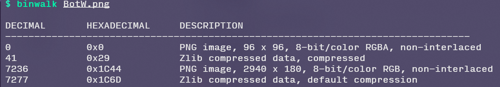

# BotW

>  公开release

## 题目描述

MASTER USING IT AND YOU CAN HAVE THIS.

全小写，格式为flag{[a-z]*}

## flag

flag{canzeldagetduplexbow}

## hints

> hints每次公布一条

1）Maybe you need binwalk(or foremost).

2）You also need LSB! Just use zsteg to detect it.

3）https://zelda.fandom.com/wiki/Sheikah_(Language)

4）https://kinglisky.github.io/zelda-words/

## wp

`binwalk`发现图片后还有图

png用`foremost`分离

用`stegsolve`依次翻看颜色通道可以看到R/G/B0通道上部都有小白点，推测是lsb

把隐写内容提取出来

也可以用lsb检测工具zsteg，看到`00000014.png`隐写了这句话

总之可以由这句搜到希卡族文化，进而搜到希卡文字（https://zelda.fandom.com/wiki/Sheikah_(Language)，同时题目描述的话（MASTER USING IT AND YOU CAN HAVE THIS.）也是用希卡文字写在希卡塔勇导石上的，对比发现与图片的文字样式大致相同。可以人肉翻译，也可以用工具（https://kinglisky.github.io/zelda-words/）。

拿到flag：**canzeldagetduplexbow**

最后以格式包裹即可。

